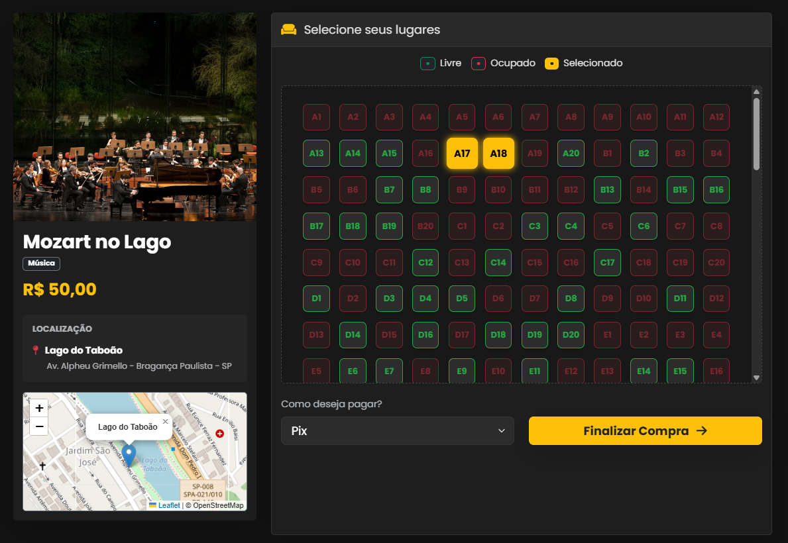
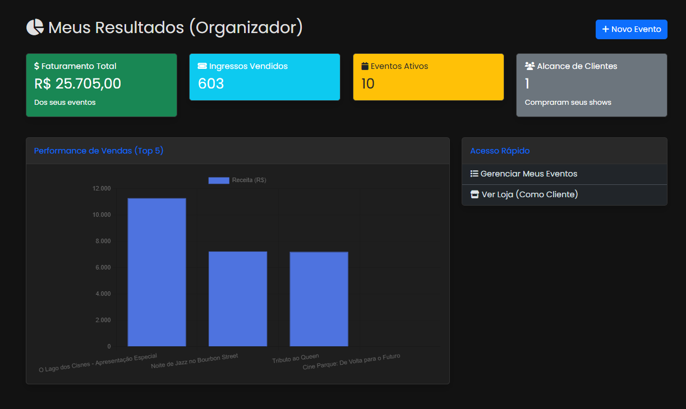
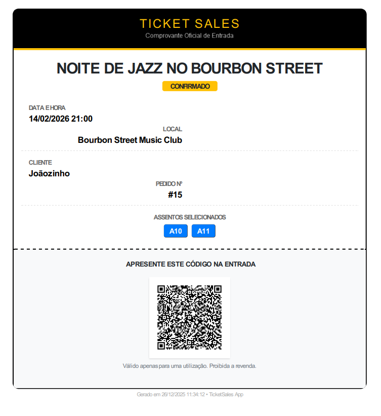
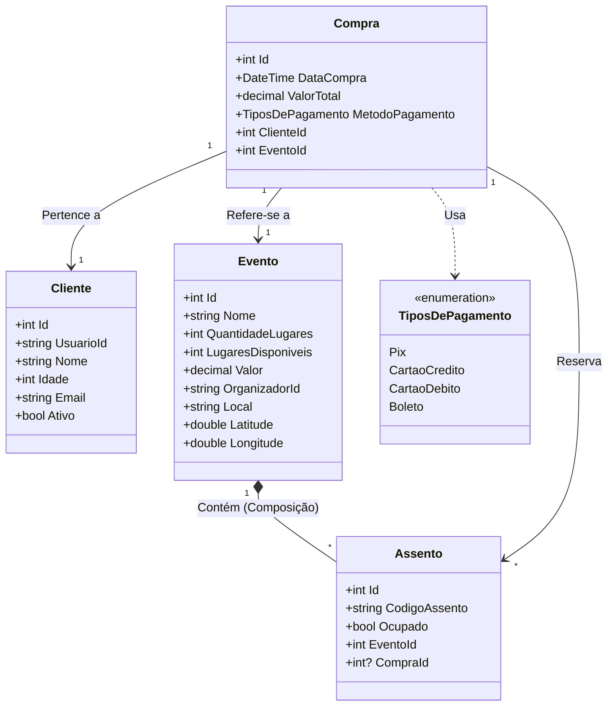

# 🎫 TicketSales - Gestão de Eventos e Ingressos


**TicketSales** é uma plataforma web completa para venda de ingressos e gestão de eventos. O sistema oferece fluxos distintos para **Organizadores** (gestão, dashboard financeiro) e **Clientes** (compra, escolha visual de assentos e carteira digital).

## 📸 Screenshots

| Loja de Eventos | Seleção de Assentos |
|:---:|:---:|
|  |  |

| Dashboard do Organizador | Ingresso (PDF + QR Code) |
|:---:|:---:|
|  |  |

---

## 🚀 Funcionalidades

### 👤 Área do Cliente
- **Compra de Ingressos:** Fluxo seguro com validação de concorrência.
- **Mapa de Assentos:** Seleção visual interativa (Livre/Ocupado/Selecionado).
- **Carteira Digital:** Visualização dos ingressos adquiridos.
- **QR Code Dinâmico:** Geração automática para entrada no evento.
- **Download em PDF:** Geração de comprovante oficial para impressão.

### 🏢 Área do Organizador / Admin
- **Dashboard Analítico:** Gráficos de vendas e faturamento em tempo real.
- **Gestão de Eventos:** CRUD completo com upload de imagens e geolocalização.
- **Validação:** Controle de lotação e status do evento.

---

## 🛠️ Tecnologias Utilizadas

* **Backend:** ASP.NET Core MVC (C#)
* **Banco de Dados:** SQL Server / Entity Framework Core
* **Autenticação:** ASP.NET Core Identity (Roles: Admin, Organizador, Cliente)
* **Geração de PDF:** [Rotativa.AspNetCore](https://github.com/webgio/Rotativa.AspNetCore) (wkhtmltopdf)
* **QR Code:** QRCoder
* **Mapas:** Integração Leaflet + OpenStreetMap
* **Frontend:** Razor Views, Bootstrap 5, JavaScript

---

## 📐 Arquitetura e Estrutura

O projeto segue o padrão **MVC** com uma camada de serviço robusta (`TicketService`) para isolar a regra de negócios dos controladores.



## ⚙️ Instalação e Execução

### Pré-requisitos
- .NET SDK (10)
- SQL Server (LocalDB ou instância completa)

### Passos

1. **Clone o repositório:**
   ```bash
   git clone https://github.com/Louiz404/TicketSales.git
   cd TicketSales

2. **Configure o Banco de Dados:**  
   No arquivo `appsettings.json`, verifique se a string de conexão `DefaultConnection` está correta para o seu ambiente.

3. **Execute as Migrations:**
   ```bash
   update-database
   
4. **Inicie a Aplicação:**
   ```bash
   dotnet run

## 🔐 Acesso Inicial (Seed Data)

Ao rodar o projeto pela primeira vez, o sistema (`SeedData.cs`) criará automaticamente um usuário **Administrador** para testes:

| Tipo | E-mail | Senha |
| :--- | :--- | :--- |
| **Admin** | `admin@ticket.com` | `Teste123@` |

> **Nota:** Você pode criar novas contas de "Organizador" ou "Cliente" diretamente pela tela de registro ("Criar Conta").

---

## 📄 Licença

Este projeto está sob a licença GNU.
